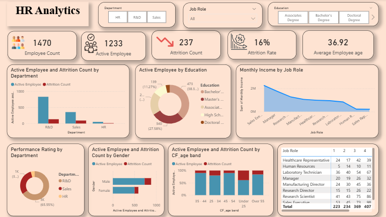

# 📊 HR Analytics Dashboard | Power BI

<p align="center">
  
</p>

## 📌 Project Overview

The **HR Analytics Dashboard** is an interactive Business Intelligence solution developed using **Microsoft Power BI** to analyze employee workforce data, understand attrition patterns, and provide actionable insights for HR decision-making.

The dashboard transforms raw employee data into a clear and interactive reporting solution covering **employee demographics, workforce distribution, attrition, compensation, education, performance, job roles, gender, and age groups**.

The project demonstrates an end-to-end analytics workflow including **data preparation, data modeling, DAX calculations, KPI development, and interactive data visualization**.

---

## 🎯 Business Objective

The primary objective of this project is to help HR teams:

- Monitor overall workforce health
- Understand employee attrition patterns
- Identify departments with higher attrition
- Analyze workforce distribution across job roles
- Compare employee demographics
- Understand employee distribution by education
- Analyze income across different job roles
- Evaluate performance patterns
- Support data-driven workforce planning and retention strategies

---

## 📈 Key Performance Indicators

| KPI | Value |
|---|---:|
| 👥 Total Employees | **1,470** |
| ✅ Active Employees | **1,233** |
| 🔻 Attrition Count | **237** |
| 📉 Attrition Rate | **16.12%** |
| 🎂 Average Employee Age | **36.92 Years** |

---

## 🔍 Dashboard Analysis

### 1. Workforce & Attrition Analysis

The dashboard provides a department-level comparison of:

- Active employees
- Employee attrition
- Workforce distribution
- Department-wise employee trends

This helps identify departments that require closer attention from an HR perspective.

### 2. Education Analysis

Employee distribution is analyzed across education levels, including:

- Bachelor's Degree
- Master's Degree
- Associate's Degree
- High School
- Doctoral Degree

This provides visibility into the educational composition of the workforce.

### 3. Job Role & Income Analysis

The dashboard analyzes monthly income across different job roles to identify compensation patterns and differences across positions.

### 4. Gender Analysis

Active employees and attrition are compared across:

- Male
- Female

This enables HR teams to understand workforce composition and attrition differences by gender.

### 5. Age Group Analysis

Employees are categorized into different age groups to understand:

- Workforce demographics
- Active employee distribution
- Attrition patterns across age bands

### 6. Performance Analysis

Performance ratings are analyzed by department to identify workforce performance patterns and compare departmental outcomes.

---

## 🎛️ Interactive Filters

The dashboard includes interactive slicers that allow users to dynamically explore the data based on:

- **Department**
- **Job Role**
- **Education**

Users can combine multiple filters to perform focused HR analysis.

---

## 🛠️ Tools & Technologies

### Business Intelligence
- **Microsoft Power BI**

### Data Preparation
- **Power Query**
- Data Cleaning
- Data Transformation
- Data Validation

### Data Analysis
- **DAX**
- KPI Development
- Aggregation
- Trend Analysis
- Descriptive Analytics

### Data Visualization
- KPI Cards
- Bar Charts
- Line / Area Charts
- Donut Charts
- Tables
- Interactive Slicers

### Version Control
- **GitHub**

---

## 🧮 Key DAX Measures

The dashboard uses DAX measures to calculate important HR metrics.

### Total Employees

```DAX
Employee Count = COUNTROWS('HR Data')

Active Employee =
CALCULATE(
    COUNTROWS('HR Data'),
    'HR Data'[Attrition] = "No"
)

Attrition Count =
CALCULATE(
    COUNTROWS('HR Data'),
    'HR Data'[Attrition] = "Yes"
)

Attrition Rate =
DIVIDE(
    [Attrition Count],
    [Employee Count],
    0
)

Average Employee Age =
AVERAGE('HR Data'[Age])
### Average Employee Age

```DAX
Average Employee Age =
AVERAGE('HR Data'[Age])
```

---

## 📊 Dashboard Components

The dashboard contains the following analytical views:

| Visualization | Purpose |
|---|---|
| KPI Cards | Monitor key HR metrics |
| Employee & Attrition by Department | Compare workforce and attrition |
| Active Employees by Education | Analyze educational distribution |
| Monthly Income by Job Role | Compare compensation patterns |
| Performance Rating by Department | Analyze performance distribution |
| Employee & Attrition by Gender | Compare gender-wise workforce patterns |
| Employee & Attrition by Age Band | Analyze age-related workforce patterns |
| Job Role Table | Detailed role-level analysis |

---

## 💡 Key Insights

The dashboard provides several high-level observations:

- The organization has **1,470 employees** in total.
- **1,233 employees are active**, while **237 employees have exited**.
- The overall employee attrition rate is approximately **16.12%**.
- **Research & Development** represents the largest employee population among the departments shown.
- Employee distribution varies across job roles and education levels.
- The dashboard enables HR teams to examine attrition across **department, gender, and age groups**.
- Monthly income varies significantly across job roles, providing an additional dimension for workforce and compensation analysis.

> **Note:** Insights are based on the provided dataset and are intended for analytical and portfolio demonstration purposes.

---

## 🏗️ Project Workflow

```text
Raw HR Dataset
      │
      ▼
Data Cleaning & Transformation
      │
      ▼
Power Query
      │
      ▼
Data Modeling
      │
      ▼
DAX Measures & KPIs
      │
      ▼
Interactive Power BI Dashboard
      │
      ▼
HR Insights & Decision Support

## 📂 Dataset

The dataset contains employee-level HR information covering areas such as:

- Employee demographics
- Age
- Gender
- Department
- Job Role
- Education
- Attrition
- Monthly Income
- Job Satisfaction
- Performance Rating
- OverTime
- Total Working Years
- Years at Company
- Years in Current Role
- Years Since Last Promotion
- Years With Current Manager

The dataset contains **1,470 employee records** and multiple employee-related attributes.

---

## 🚀 How to Use the Dashboard

### Option 1 — Open the Power BI File

1. Download `HR_Analytics.pbix` from this repository.
2. Open the file using **Microsoft Power BI Desktop**.
3. Interact with the dashboard using the available slicers and visuals.

### Option 2 — Explore the Repository

Use the dataset and dashboard screenshot available in this repository to understand the analysis and reporting approach.

---

## 💼 Skills Demonstrated

This project demonstrates practical experience in:

- Power BI Dashboard Development
- Data Cleaning & Transformation
- Power Query
- DAX
- KPI Development
- Data Visualization
- Business Intelligence
- HR Analytics
- Attrition Analysis
- Workforce Analytics
- Data Storytelling
- Business Insights
- GitHub & Project Documentation

---

## 👩‍💻 Author

### Astha Gupta

**Data Analyst | Power BI | SQL | Python | Excel**

Interested in transforming data into meaningful business insights through analytics, visualization, and business intelligence.

---

## ⭐ Project Highlights

**1,470+ Employees** • **5+ KPI Metrics** • **Multiple Interactive Visualizations** • **Power BI + DAX + Power Query**

---

## 📬 Feedback

If you find this project useful or have suggestions for improving the dashboard, feel free to connect or provide feedback.

⭐ If you find this project interesting, consider giving the repository a **Star**.
